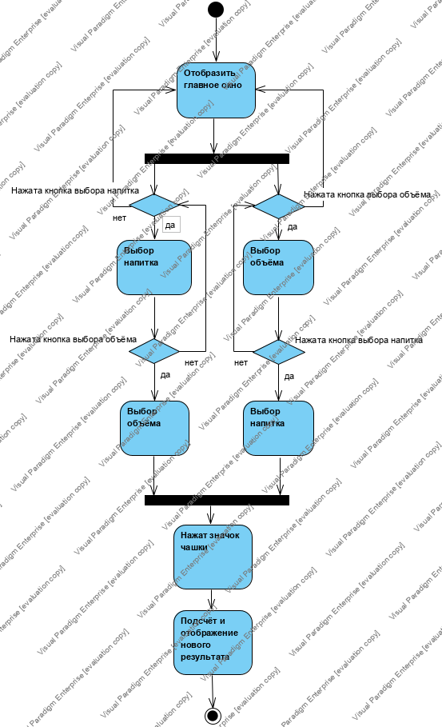
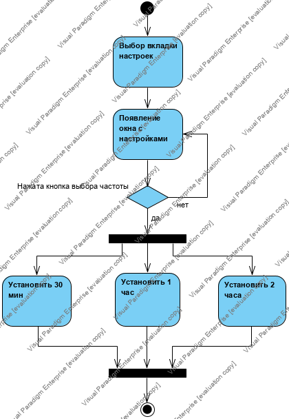
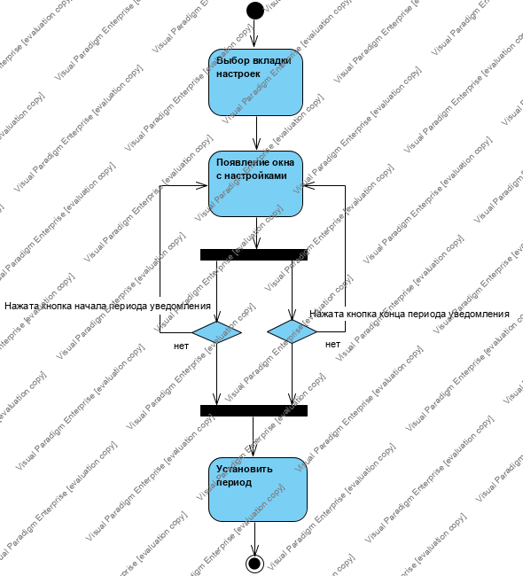

# Диаграммы активности

# Содержание
1. [Войти в приложение](#1)  
2. [Установить частоту уведомления](#2)  
3. [Установить период времени уведомления](#3)

<a name="1"/>

# 1. Войти в приложение 

<a name="2"/>

# 2. Установить частоту уведомления

<a name="3"/>

# 3. Установить период времени уведомления

