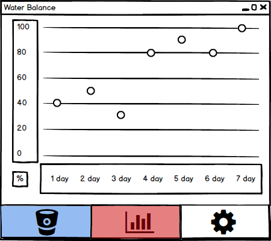

# Требования к проекту
---

# Содержание
1 [Введение](#intro)  
1.1 [Назначение](#appointment)  
1.2 [Бизнес-требования](#business_requirements)  
1.2.1 [Исходные данные](#initial_data)  
1.2.2 [Возможности бизнеса](#business_opportunities)  
1.3 [Аналоги](#analogues)  
2 [Требования пользователя](#user_requirements)  
2.1 [Программные интерфейсы](#software_interfaces)  
2.2 [Интерфейс пользователя](#user_interface)  
2.3 [Характеристики пользователей](#user_specifications)  
2.3.1 [Классы пользователей](#user_classes)  
2.3.2 [Аудитория приложения](#application_audience)  
2.3.2.1 [Целевая аудитория](#target_audience)  
2.3.2.1 [Побочная аудитория](#collateral_audience)  
2.4 [Предположения и зависимости](#assumptions_and_dependencies)  
3 [Системные требования](#system_requirements)  
3.1 [Функциональные требования](#functional_requirements)  
3.1.1 [Основные функции](#main_functions)  
3.1.1.1 [Вход пользователя в приложение](#enter_to_app)  
3.1.1.2 [Добавление выпитого напитка](#adding_a_drink)  
3.1.1.3 [Отображение ползунка выпитой жидкости](#drinking_fluid_slider_display)           
3.1.1.4 [Просмотр диаграммы за период времени](#view_a_chart_over_a_period_of_time)  
3.1.1.5 [Редактирование данных](#data_editing)  
3.1.2 [Ограничения и исключения](#restrictions_and_exclusions)  
3.2 [Нефункциональные требования](#non-functional_requirements)  
3.2.1 [Атрибуты качества](#quality_attributes)  
3.2.1.1 [Требования к удобству использования](#requirements_for_ease_of_use)  
 3.2.2 [Внешние интерфейсы](#external_interfaces)   

<a name="intro"/>

# 1 Введение

<a name="appointment"/>

## 1.1 Назначение
В этом документе описаны функциональные и нефункциональные требования к приложению Watbalrem( Water Balance Reminder), благодаря которому можно просматривать, сколько воды уже выпил и сколько ещё необходимо до полного водного баланса, это приложение высчитает для каждого человека свою норму жидкости, которую необходимо выпить в сутки, и будет напоминать, чтобы этот человек придерживался нормы и чувствовал себя весь день прекрасно. Этот документ предназначен для команды, которая будет реализовывать и проверять корректность работы приложения. 

<a name="business_requirements"/>

## 1.2 Бизнес-требования

<a name="initial_data"/>

### 1.2.1 Исходные данные
Если вы не испытываете чувство жажды, это совсем не означает, что ваш организм не нуждается в жидкости. Ежедневно различными способами мы тратим 1.5-2,5 литра воды при комфортной температуре и влажности воздуха, а во время жары и при физических нагрузках – еще больше. Это должно насторожить всех, кто говорит, что прекрасно справляется без питья чистой воды, будто бы заменяя ее чаем, соками, овощами и фруктами.
Правильный питьевой режим подразумевает сохранение физиологического водного баланса - это уравновешивание поступления и образования воды с ее выделением.
Если организм получает достаточное количество воды, то человек становится более энергичным и выносливым. Ему проще контролировать свой вес, поскольку улучшается пищеварение, а когда вас тянет перекусить, часто достаточно бывает просто попить воды, чтобы снизить аппетит.Регулярное потребление воды улучшает мышление и координационные действия мозга. Головной мозг и весь организм будут достаточно заряжены нужными веществами, если вода, которую мы пьем, будет высокого качества, то есть, будет богата минеральными веществами. Здоровый человек не должен ограничивать себя в питье, но гораздо полезнее пить часто и понемногу. Вредно выпивать сразу много жидкости, так как вся жидкость всасывается в кровь, и, пока ее излишек не будет выведен из организма почками, сердце получает излишнюю нагрузку.

<a name="business_opportunities"/>

### 1.2.2 Возможности бизнеса
Watbalrem - то лёгкая и функцциональная напоминалка по приёму воды в течение дня, которая поможет вам пить воду вовремя, привести в норму водный баланс, похудеть, очистить организм и улучшить здоровье. Вам не нужно следить за временем - это приложение автомически напомнит вам, когда нужно выпить стакан воды. Благодаря простому интуитивному дизайну приложением очень удобно пользоваться. Настраиваемые параметры помогут легко зафиксировать достигнутые вами результаты, а напоминания помогут привыкнуть регулярно пить чистую воду. Всего месяц использования этого приложения - и вы получите полезную привычку пить воду.
<a name="project_boundary"/>

<a name="analogues"/>

## 1.3 Аналоги
Обзор аналогов представлен в документе [**Overview of analogues.md**](Overview%20of%20analogues.md)

<a name="user_requirements"/>

# 2 Требования пользователя

<a name="software_interfaces"/>

## 2.1 Программные интерфейсы
Будет использована JavaFX — платформа на основе Java для создания приложений с насыщенным графическим интерфейсом.

<a name="user_interface"/>

## 2.2 Интерфейс пользователя
Окно входа в приложение.    
 
 
Окно добавления выпитого напитка.    
 
 
Окно успехов за неделю в виде диаграммы.    
 
 
Окно настроек.    
 

<a name="user_specifications"/>

## 2.3 Характеристики пользователей

<a name="user_classes"/>

### 2.3.1 Классы пользователей

| Класс пользователей | Описание |
|:---|:---|
| Анонимные пользователи | Все пользователи. Имеют доступ ко всему функционалу |

<a name="application_audience"/>

### 2.3.2 Аудитория приложения

<a name="target_audience"/>

#### 2.3.2.1 Целевая аудитория
Люди любой возрастной категории, обладающие минимальной компьютерной грамотностью.

<a name="collateral_audience"/>

#### 2.3.2.2 Побочная аудитория
Пользователи любой категории. В основном студенты.

<a name="assumptions_and_dependencies"/>

## 2.4 Предположения и зависимости
Приложение будет работать при отсутствии подключения к Интернету;

<a name="system_requirements"/>

# 3 Системные требования

<a name="functional_requirements"/>

## 3.1 Функциональные требования

<a name="main_functions"/>

### 3.1.1 Основные функции

<a name="enter_to_app"/>

#### 3.1.1.1 Вход пользователя в приложение
Пользователь имеет возможность использовать приложение без создания собственного профиля.

<a name="adding_a_drink"/>

#### 3.1.1.2 Добавление выпитого напитка
Пользователь может выбрать объём и вид напитка, который только что выпил.

<a name="drinking_fluid_slider_display"/>

#### 3.1.1.3 Отображение ползунка выпитой жидкости
Пользователь имеет возможность просмотреть сколько он уже выпил за день и сколько ему осталось выпить до суточной нормы.

<a name="view_a_chart_over_a_period_of_time"/>

#### 3.1.1.4 Просмотр диаграммы за период времени
Пользователь имеет возможность просмотреть свои успехи выполнения требуемой нормы за неделю.

<a name="data_editing"/>

#### 3.1.1.5 Редактирование данных
Человек не весит всегда одинаково, поэтому пользователь имеет возможность редактировать свой вес, для того, чтобы приложение высчитало новую требумую норму выпитой жидкости за день. Также пользователь может выбрать период времени, в течение которого ему будет приходить уведомление с частотой и звуковым оповещением(эти характеристики пользователь также может изменять).

<a name="restrictions_and_exclusions"/>

### 3.1.2 Ограничения и исключения
1. Нет профиля пользователя;
2. Нет возможности просмотра, какие были выпиты напитки за день.

<a name="non-functional_requirements"/>

## 3.2 Нефункциональные требования

<a name="quality_attributes"/>

### 3.2.1 Атрибуты качества

<a name="requirements_for_ease_of_use"/>

#### 3.2.1.1 Требования к удобству использования
1. Простой и интуитивно понятный интерфейс пользователя;
2. Доступ к основным функциям приложения не более чем за две операцию;
3. Пошаговая инструкция использования основных функций приложения отображена в справке;

<a name="external_interfaces"/>

### 3.2.2 Внешние интерфейсы
Окна приложения удобны для использования пользователями с плохим зрением. Функциональные элементы контрастны фону окна, название и символы элементов интерфейса напрямую описывают их функционал.
